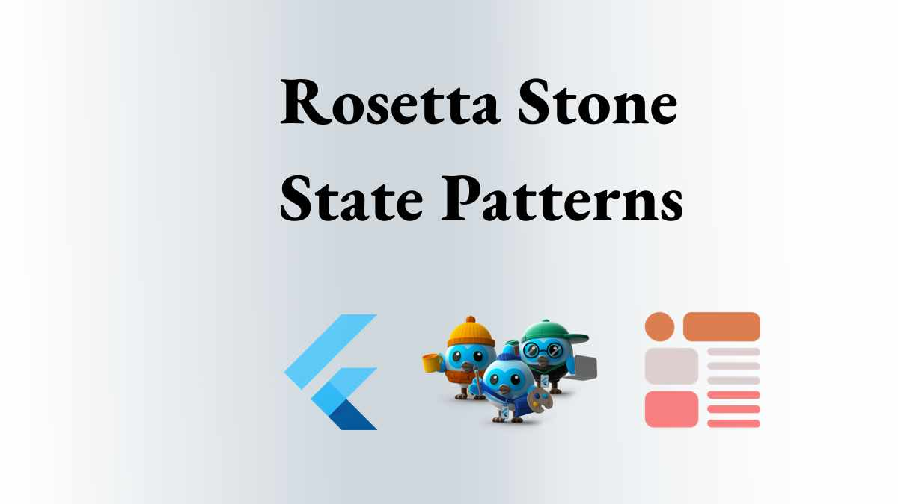

# Rosetta Stone State Patterns

A Rosetta Stone Of Flutter State management patterns. 

## Implementation

To keep things simple I am using the attributes common to 
both Domain Driven Design and Clean Architecture in that 
layers are separated into domain and presentation. And, I start out with a counter app example that becomes the Rosetta Stone in each state management solution uses the same counter app example.

## Articles

[Rosetta Stone Of Flutter State Management, setState](https://medium.com/p/rosetta-stone-of-flutter-state-management-setstate-1b017da53fac)

[View Model State And Dependency Inject Using Provider}(https://medium.com/p/view-model-state-and-dependency-injection-with-provider-edf1418014fd)

[Use View Model Implementations To Learn Flutter](https://medium.com/p/use-view-model-implementations-to-learn-flutter-7095898ff015)

[Why You SHould Buy A Flutter UI Kit](https://medium.com/p/why-you-should-buy-a-flutter-ui-kit-9c78c1a21156)

[The UI Kit And Architecture Kit Way Of Writing Flutter Books](https://medium.com/p/the-ui-kit-and-architecture-kit-way-of-writing-flutter-books-f7ec9167b289)

[Why You Should USe DDD App Architecture](https://medium.com/p/why-you-should-use-ddd-app-architecture-to-learn-flutter-7944885da1f1)

## Flutter Architecture Kits

